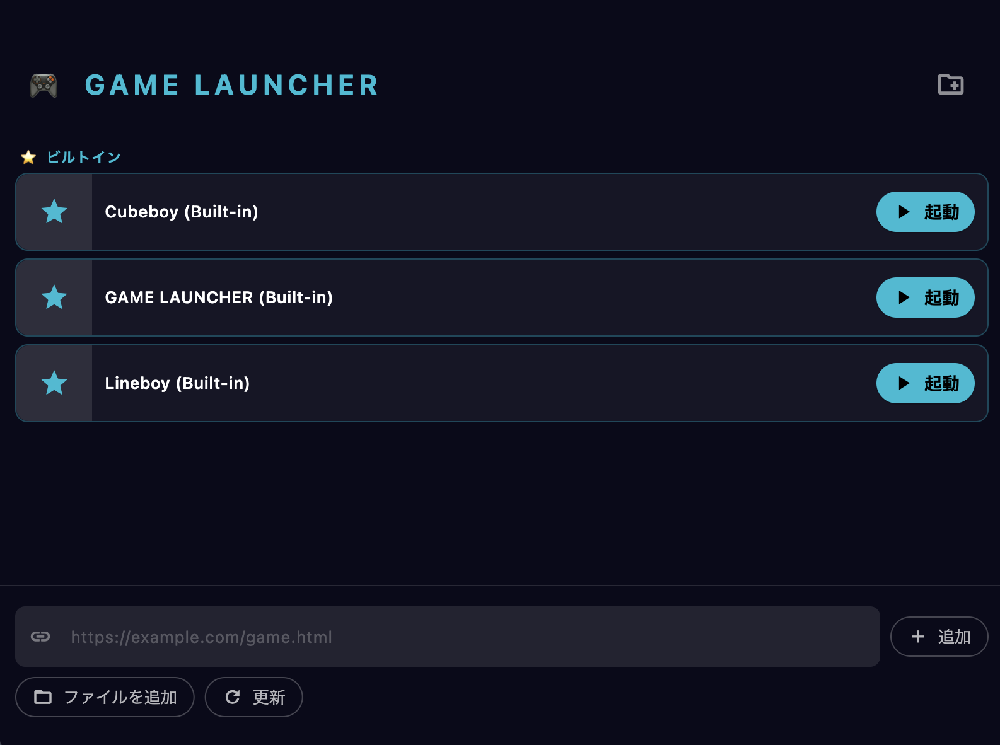
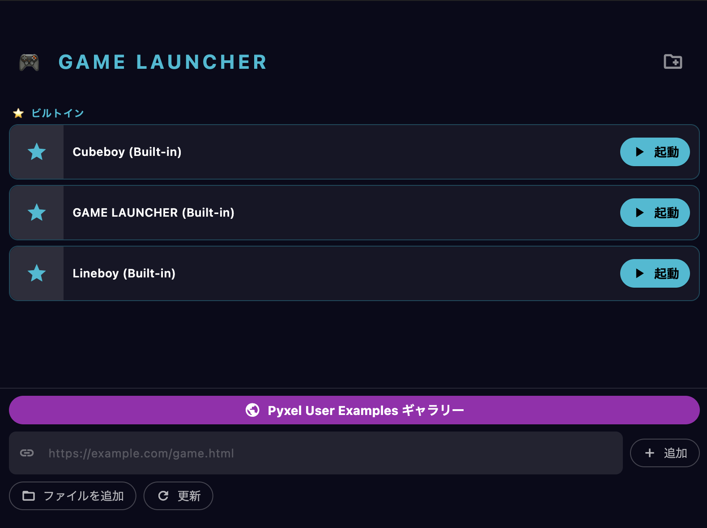

# GAME LAUNCHER ポートフォリオ

## 概要

**GAME LAUNCHER** は、Pyxel製HTMLゲームや自作ゲームを簡単に管理・起動できるランチャーアプリです。ビルトインゲームやユーザー追加ゲーム、フォルダ分け、削除・リネームなど多彩な管理機能を備えています。

## 特徴
- ビルトインゲーム搭載（Cubeboy, R.P..G...8bit, Lineboy）
- ファイル追加・URL追加・フォルダ管理
- ゲームの削除・リネーム・移動
- シンプルで直感的なUI
- Pyxel互換HTMLゲームに最適化

## スクリーンショット

### ビルトインゲーム一覧

### Gallery（オプション機能）

## Gallery（ギャラリー）機能

Pyxelユーザー作品を一覧表示できるオプション機能です。ボタン一つでギャラリー画面に遷移し、他のユーザー作品を閲覧・起動できます。

## 使い方
1. アプリを起動
2. 「ファイルを追加」やURL入力でゲームを追加
3. ゲームを起動・管理
4. 必要に応じてギャラリー機能を有効化

## ディレクトリ構成
- `lib/` ... アプリ本体のDartコード
- `docs/` ... 本ドキュメント

---

ご質問・ご要望はIssueまたはPRでお知らせください。
